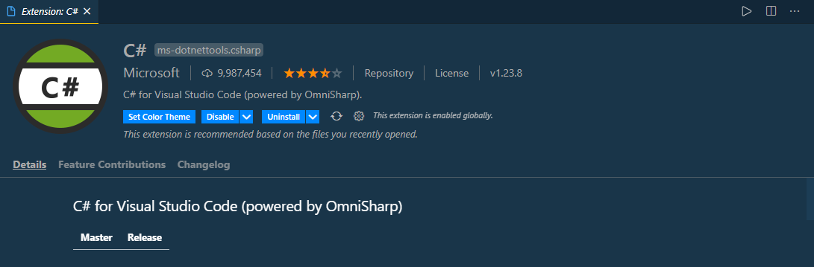

# C# Crash Course 
This course was followed from [freecodecamp](https://www.freecodecamp.org/). You can follow their website for more amazing informations.

## You can follow these procedures to run C# codes in your windows machine
- Software (as IDE):
  - [Microsoft Visual Studio 2019](https://visualstudio.microsoft.com/vs/) or
  - [Visual Studio Code](https://code.visualstudio.com/) [ I personally prefer VS Code ]
    - Follow these steps to prepare your windows machine properly for running C# programs
      - [Download .NET Core](https://dotnet.microsoft.com/download)
      - Check the version of the .NET Core by running this command through your terminal. You will get the version information.
        ```
        dotnet --version
        ```
      - Open VS Code. Go to the extensions section and install c# extension.
        

## You can follow this index for maintaining the serial: ##

1.  [Hello World](https://github.com/FahimFBA/csharp-crash-course/blob/main/HelloWorld/HelloWorld/Program.cs)
2.  [Variables](https://github.com/FahimFBA/csharp-crash-course/blob/main/Variables/Variables/Program.cs)
3.  [Data Types](https://github.com/FahimFBA/csharp-crash-course/blob/main/DataType/DataType/Program.cs)
4.  [Working With String](https://github.com/FahimFBA/csharp-crash-course/blob/main/AddString/AddString/Program.cs)
5.  [Working With Numbers](https://github.com/FahimFBA/csharp-crash-course/blob/main/WorkingWithNumbers/WorkingWithNumbers/Program.cs)
6.  [Getting User Input](https://github.com/FahimFBA/csharp-crash-course/blob/main/GettingUserInput/GettingUserInput/Program.cs)
7.  [Building A calculator](https://github.com/FahimFBA/csharp-crash-course/blob/main/BuildingACalculator/BuildingACalculator/Program.cs)
8.  [Building A Mad Lib](https://github.com/FahimFBA/csharp-crash-course/blob/main/BuildingAMadLib/BuildingAMadLib/Program.cs)
9.  [Arrays](https://github.com/FahimFBA/csharp-crash-course/blob/main/Arrays/Arrays/Program.cs)
10.  [Methods](https://github.com/FahimFBA/csharp-crash-course/blob/main/Methods/Methods/Program.cs)
11. [Return Statement](https://github.com/FahimFBA/csharp-crash-course/blob/main/ReturnStatement/ReturnStatement/Program.cs)
12. [If Statement](https://github.com/FahimFBA/csharp-crash-course/blob/main/IfStatement/IfStatement/Program.cs)
13. [If Statement Continuing](https://github.com/FahimFBA/csharp-crash-course/blob/main/MoreIfStatements/MoreIfStatements/Program.cs)
14. [Building A Better Calculator](https://github.com/FahimFBA/csharp-crash-course/blob/main/BuildingABetterCalculator/BuildingABetterCalculator/Program.cs)
15. [Switch Statements](https://github.com/FahimFBA/csharp-crash-course/blob/main/SwitchStatements/SwitchStatements/Program.cs)
16. [While Loops](https://github.com/FahimFBA/csharp-crash-course/blob/main/WhileLoop/WhileLoop/Program.cs)
17. [Do While Loops](https://github.com/FahimFBA/csharp-crash-course/blob/main/DoWhileLoop/DoWhileLoop/Program.cs)
18. [Building A Guessing Game](https://github.com/FahimFBA/csharp-crash-course/blob/main/BuildingAGuessingGame/BuildingAGuessingGame/Program.cs)
19. [For Loops](https://github.com/FahimFBA/csharp-crash-course/blob/main/ForLoops/Program.cs)
20. [Building An Exponent Method](https://github.com/FahimFBA/csharp-crash-course/blob/main/BuildingAnExponentMethod/Program.cs)
